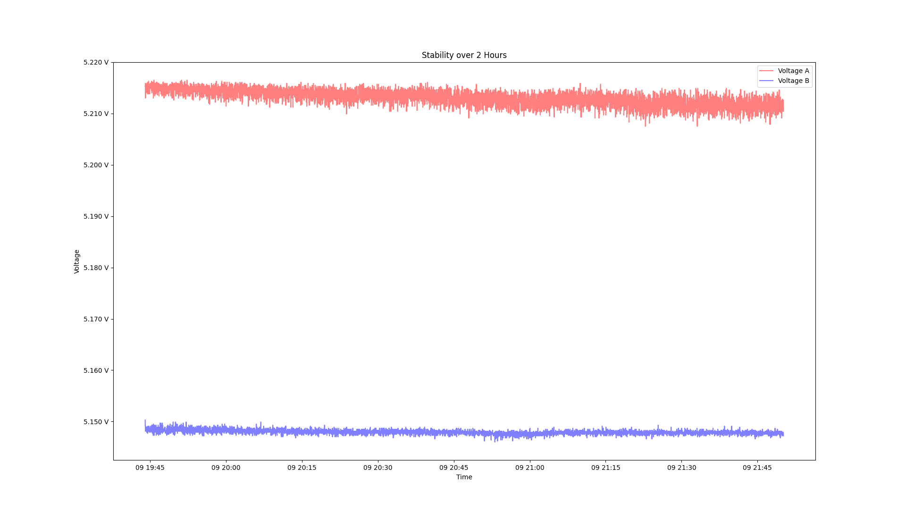

layout: page
title: "Measurments"
permalink: /measurments/

# Measurments
## Revision 0.1
### Stability over 2 Hours
Measured against reference voltage source REF02

#### Parameters:
- Duration: 2 Hours
- Frequency: 1s (approx.)
- Attentuatuation before LM324N: 8 (rough setting)
- LSB at ADC: approx 9,765mV (with Attentuation of 8)
- Internal Averaging Samples: 50

### Voltage A (Sense A):
| Value | Measurment |
| ------------------| ---------- |
|Standard Deviation| 1,456 mV    |
|Maximum Value|      5.216500 V  |
|Minimum Value|      5.207500 V  |
|Mean Value|         5.213059 V  |
|25% of Counts|      5.212000 V  |
|50% of Coutns|      5.213200 V  |
|75% of Counts|      5.214200 V  |

### Boxplot and Histogram
[[https://github.com/neuschs/constant_current_source/measurements/revision_0.1/histogram_boxplot_2hours_voltage_a.png|alt=octocat]]

### Voltage B (Sense B):
| Value | Measurment |
| ------------------| ----------  |
|Standard Deviation| 411 uV       |
|Maximum Value:    |  5.150300 V  |
|Minimum Value:    |  5.146000 V  |
|Mean Value:       |  5.147937 V  |
|25% of Counts:    |  5.147700 V  |
|50% of Coutns:    |  5.147900 V  |
|75% of Counts:    |  5.148100 V  |

### Boxplot and Histogram

### Overview over 2 Hours

### Result
> In some mysterious way, Sense A voltage measrument is way more bad than Sense B. Next measurment will be done over 24h with better shielding against the USB connection which is directly over the input attentuation voltage divider.

